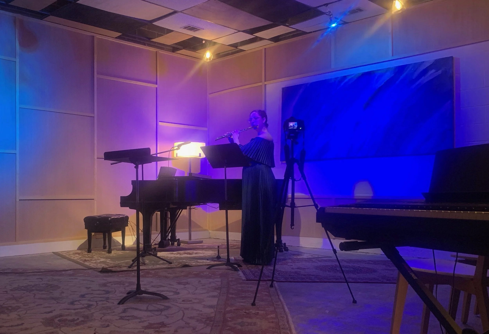
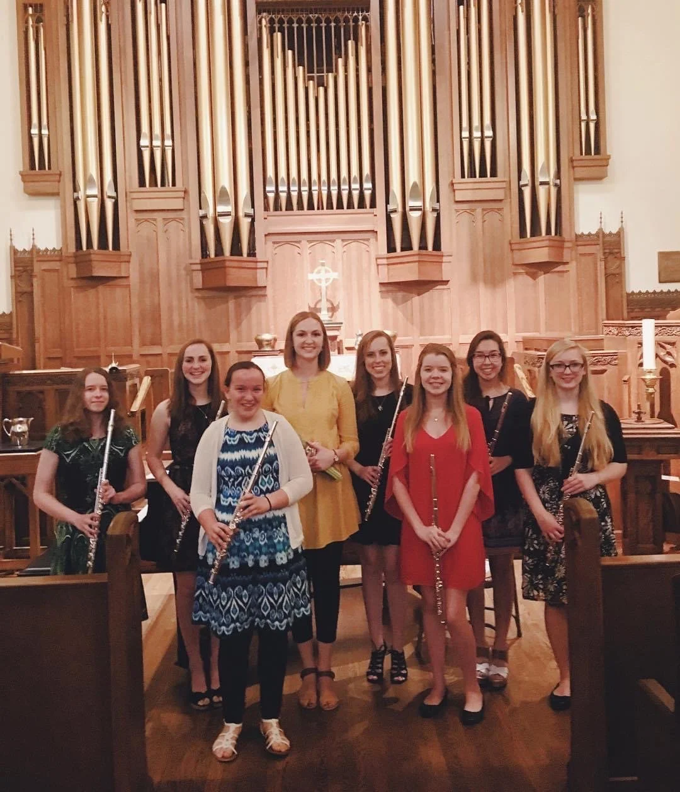
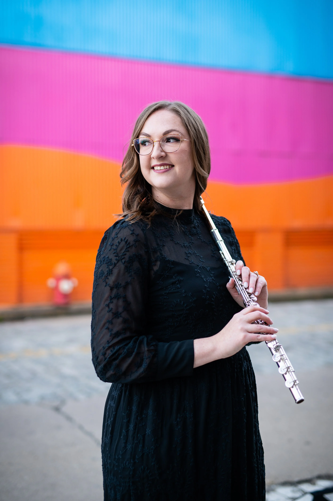

# Dr. Allison Jayroe Asthana

## Hero

Performance work centered on chamber music, orchestral collaborations, arts leadership, and projects that connect Western and Indian classical influence.

I am based in Houston and currently balancing performing, curating, teaching, and ensemble leadership across Texas.

[View the calendar](calendar.html)

[Contact me about a project](index.html#contact)

## Current Activities
### Monarch Chamber Players

I serve as Executive Director and flutist with Monarch Chamber Players, helping shape artistic direction, partnerships, audience development, and collaborative programming while continuing to perform as part of the ensemble.

My work with Monarch centers on thoughtful, high-level chamber music experiences that feel artistically rigorous and welcoming to audiences.

### Emissary Quartet

With Emissary Quartet, I contribute as both performer and educator. This work includes chamber performance, educational activity, and community-facing programming that highlights the quartet’s versatility.

Emissary allows me to combine polished ensemble playing with teaching and outreach in a way that feels central to my artistic life.

### Orchestral Work

I also perform with orchestras around the state, bringing a chamber musician’s attention to color, collaboration, and flexibility into larger ensemble settings.

This part of my work complements my chamber and solo activity and keeps me connected to a wide range of repertoire and performance contexts.

## Performance Focus
My performance work moves fluidly between solo, chamber, and orchestral settings. Across all three, I am especially interested in programming that feels personal, communicative, and musically vivid.

I am drawn to repertoire by underrepresented composers, music shaped by cross-cultural influence, and performances that invite audiences into a genuine listening experience rather than a distant one.

## Contact
For chamber engagements, collaborations, educational residencies, or orchestra inquiries, please email [allison.asthana@gmail.com](mailto:allison.asthana@gmail.com) or connect through [Instagram](https://instagram.com/allisonasthana).
